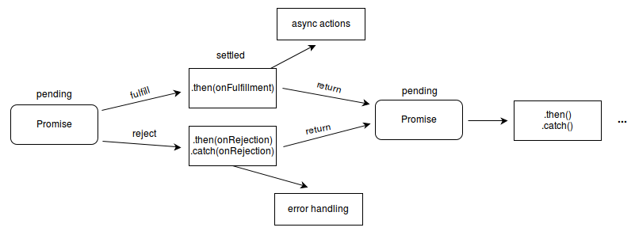

# 回调函数
 > JS中大部分所有的回调函数都是异步的 当然也存在同步的回调

 - 异步回调
  1. 定时器的回调函数
  1. DOM事件的回调函数
  1. Node中绝大部分的回调
  1. ajax的回调函数
 - 同步
  1. 数组的API
  2. Promise构造函数的第一个参数
   
# Promise
     Promise 对象用于表示一个异步操作的最终状态（完成或失败），
     Promise在回调代码和将要执行这个任务的异步代码之间提供了一种可靠的中间机制来管理回调。
     本质上Promise就是一个构造函数。  Promise的实例对象有三个状态
              pending: 初始状态，既不是成功，也不是失败状态。
              fulfilled: 意味着操作成功完成。
              rejected: 意味着操作失败
              
## Promise语法
    //第一个参数一般我们称为executor
    new Promise( function(resolve, reject) {...})
### executor    
    executor是带有 resolve 和 reject 两个参数的函数 。Promise构造函数执行时立即调用executor 函数，在实例对象被返回前。
    resolve 和 reject 两个函数作为参数传递给executor。 resolve 和 reject 函数被调用时，
    分别将promise的状态改为fulfilled（完成）或rejected（失败）。
    executor 内部通常会执行一些异步操作，
      一旦完成，可以调用resolve函数来将promise状态改成fulfilled，
      或者在发生错误时调用reject函数将它的状态改为rejected。
    如果在executor函数中抛出一个错误，那么该promise 状态为rejected。
    executor函数的返回值被忽略。
### 代码示例    
    var promise = new Promise(function(resolve, reject) {
      setTimeout(resolve, 100, 'foo');
    });
    
## Promise状态机制
  executor的resolve参数被调用时会将promise的状态从pending改为fulfilled
  executor的reject参数被调用时会将promise的状态从pending改为rejected
  如果在executor函数中抛出一个错误，那么该promise 状态为rejected
  
### Promise状态机制相关API
#### Promise.prototype.then
    当promise对象的状态发生改变时，绑定在其身上的then方法就会被调用。
    then方法包含两个参数：onresolved函数 和 onrejected函数，它们都是 Function 类型。当Promise状态为fulfilled时，调用 then 的 onfulfilled 方法，当Promise状态为rejected时，调用 then 的 onrejected 方法， 所以在异步操作的完成和绑定处理方法之间不存在竞争
    then() 方法返回一个  Promise 。  
      语法
        p.then(onresolved, onRejected);
    参数
        onresolved：
          当Promise变成接受状态时，该参数作为回调函数被调用。该函数有一个参数，即接受的最终结果。
          由executor中resolve的第一个参数提供
        onRejected
          当Promise变成拒绝状态（rejection ）时，该参数作为回调函数被调用该函数有一个参数,，即拒绝的原因。
          由executor中reject的第一个参数提供。或系统提供的报错信息。
    返回值
        then方法返回一个新的Promise，而它的行为与then中的回调函数的返回值有关：
          如果then中的回调函数返回一个值，那么then返回的Promise将会成为接受状态，并且将返回的值作为接受状态的回调函数的参数值。
          如果then中的回调函数抛出一个错误，那么then返回的Promise将会成为拒绝状态，并且将抛出的错误作为拒绝状态的回调函数的参数值。
          如果then中的回调函数返回一个已经是接受状态的Promise，那么then返回的Promise也会成为接受状态，并且将那个Promise的接受状态的回调函数的参数值作为该被返回的Promise的接受状态回调函数的参数值。
          如果then中的回调函数返回一个已经是拒绝状态的Promise，那么then返回的Promise也会成为拒绝状态，并且将那个Promise的拒绝状态的回调函数的参数值作为该被返回的Promise的拒绝状态回调函数的参数值。
          如果then中的回调函数返回一个未定状态（pending）的Promise，那么then返回Promise的状态也是未定的，并且它的终态与那个Promise的终态相同；同时，它变为终态时调用的回调函数参数与那个Promise变为终态时的回调函数的参数是相同的。

  
## Promise链式调用
    Promise.prototype.then方法反回的也是一个promise对象。所以我们可以进行链式调用
   。

    
    
    
          
              

