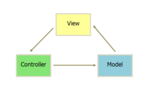
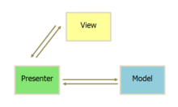

# vue
## 官网
  >  https://vuejs.org/    
  >  https://cn.vuejs.org/
## 介绍描述
   - 作者: 尤雨溪(一位华裔前Google工程师)
   > 
   - 尚硅谷vue布道师:张晓飞(一位年近花甲的全栈工程师)
   > 
   - 渐进式JavaScript 框架
    ```
        渐进式主要体现在vue的使用和学习路线并不陡峭,
        vue本身只是一个视图层的框架.只负责数据的渲染.
        没有ajax获取数据的能力,没有布局能力.
        就连最擅长的数据处理在遇到复杂业务场景时,也变的很艰难起来.
        这就需要大量的第三库来支持vue进行复杂应用开发.
        当然如果你的项目不复杂你就不必使用这些第三方库(第三方生态)
    ```   
       1. vue-loader : vue模板加载器
       1. vue-cli   :   vue脚手架 
       1. vue-router:   vue路由	    
       1. vuex: 状态管理
       1. axios(vue-resource): ajax请求				
       1. vue-lazyload: 图片懒加载	
       1. vue-scroller: 页面滑动相关			
       1. mint-ui: 基于vue的UI组件库(移动端) 
       1. element-ui: 基于vue的UI组件库(PC端)
   - 作用: 动态构建用户界面 
## vue特点
 1.	编码简洁, 体积小, 运行效率高, 适合移动端开发(当然也适合pc)
 1.	它本身只关注UI, 可以轻松引入vue插件或其它第三库开发项目
 1.	遵循MVVM模式
  - > mvc
    <br/>  
    
  - > mvp
    <br/>
    
  - > mvvn
    <br/>
       
    
    
## 与其它前端JS框架的关联  
 1.	借鉴angular的 模板 和 数据绑定  技术
 1.	借鉴react的 组件化 和 虚拟DOM 技术
## Vue源码版本对比
  
  - > UMD: 版本可以通过 `<script>` 标签直接用在浏览器中
    - > 完整版：同时包含编译器和运行时的版本
    - > 编译器：用来将模板字符串编译成为 JavaScript 渲染函数的代码。
    - > 运行时：用来创建 Vue 实例、渲染并处理虚拟 DOM 等的代码。基本上就是除去编译器的其它一切
  - > CommonJS：CommonJS 版本用来配合老的打包工具比如 Browserify 或 webpack 1。这些打包工具的默认文件 (pkg.main) 是只包含运行时的 CommonJS 版本 (vue.runtime.common.js)
  - > ES Module：为诸如 webpack 2 或 Rollup 提供的现代打包工具。ESM 格式被设计为可以被静态分析，所以打包工具可以利用这一点来进行“tree-shaking”并将用不到的代码排除出最终的包。为这些打包工具提供的默认文件 (pkg.module) 是只有运行时的 ES Module 构建 (vue.runtime.esm.js)


  

   


